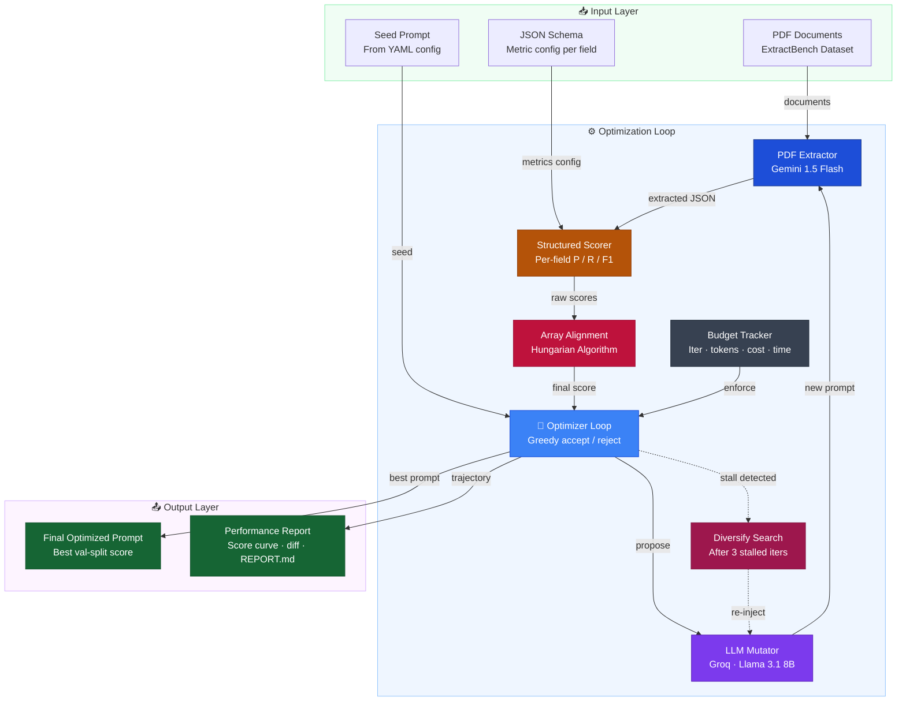

# Automated Prompt Optimizer for Structured Extraction

[](https://github.com/pranshulgupta33940/llm-calling-llm)
[](https://python.org)
[](https://aistudio.google.com)
[](https://console.groq.com)
[](LICENSE)

An agentic, production-grade prompt optimization system that automatically refines LLM prompts to maximize the quality of structured JSON extraction from complex PDF documents. Operating under multi-resource budgets (cost, time, tokens, iterations), the system runs a greedy hill-climbing optimization loop with stall-detection and diversification.

---

##  How it Works

The optimizer starts with a **Seed Prompt**, loads the PDF documents, parses the JSON target schema, and executes a feedback loop using two LLM providers (Google Gemini & Groq/Llama) and a mathematical scoring layer.


```

## Imporant things to be noted about this :-

Dual-LLM Setup: Fast and free PDF extraction using Gemini 2.5 Flash through native PDF uploads in Google AI Studio, combined with grading and mutation using Groq (Llama 3.1 8B).
Smart Item Alignment: Uses the Hungarian algorithm to accurately match list and array items, even when outputs are unordered or list sizes differ.
Efficient Caching System: SQLite-based disk caching for PDF extractions and LLM grading results to prevent repeated API calls and improve performance.
Advanced Budget Controls: Supports limits on API cost, token usage, execution time, and iteration count, with graceful shutdown and resumability.
Automatic Reporting: Generates detailed markdown reports with prompt evolution tracking, validation/test metrics, and prompt revision diffs.

---

##  Quick Start

### 1. Clone & Set Up environment

```bash
git clone https://github.com/pranshulgupta33940/llm-calling-llm.git
cd llm-calling-llm/prompt_optimizer
pip install -e ".[dev]"
```

### 2. Configure API Keys (Free Tier)

Set your free keys in your shell:

**Windows PowerShell:**
```powershell
$env:GOOGLE_API_KEY = "your-google-api-key"
$env:GROQ_API_KEY = "your-groq-api-key"
```

**Linux / macOS:**
```bash
export GOOGLE_API_KEY="your-google-api-key"
export GROQ_API_KEY="your-groq-api-key"
```

### 3. Run the Optimization Pipeline

```bash
# Run a dry-run first (uses at most 2 docs per split for near-zero cost verification)
python -m src.main --config config/default.yaml --dry-run

# Run full optimization loop on academic/research schema
python -m src.main --config config/default.yaml

# Run optimization on credit agreements (Alternate Schema)
python -m src.main --config config/alternate_schema.yaml
```

### 4. Run Unit Tests

Verify the scoring alignment, caching, and schema parsing modules:
```bash
python -m pytest tests/ -v
```

---

## Sample Optimization Report

During the test execution on the `academic/research` schema, the optimizer refined the seed prompt over 5 iterations, producing the following gains:

### Score Evolution Curve
| Iteration | Val Score | Accepted | Action / Change |
| :---: | :---: | :---: | :--- |
| **0** | `0.8790` | ✓ | Seed prompt evaluation baseline |
| **1** | `0.8790` | ✗ | Rejected: No score improvement |
| **2** | `0.9790` | ✓ | **Accepted: +0.1000** (added explicit detail guidelines) |
| **3** | `0.9790` | ✗ | Rejected: No score improvement |
| **4** | `0.9900` | ✓ | **Accepted: +0.0110** (added formatting/order guidelines) |
| **5** | `0.8890` | ✗ | Rejected: Regressed score |

### Prompts Evolution Diff

```diff
--- Seed Prompt (Iteration 0)
+++ Final Optimized Prompt (Iteration 4)
-You are a precise document extraction system. Your task is to extract
-structured information from the provided PDF document according to the
-JSON schema below.
+You are a highly accurate document extraction system. Your task is to extract structured information from the provided PDF document according to the JSON schema below, with a focus on precision and thoroughness.
 
-RULES:
-- Return ONLY a valid JSON object that matches the schema structure exactly.
-- Extract ALL fields present in the document. Use null for missing fields.
-- For array fields, include EVERY matching item found in the document.
-- Be thorough and accurate. Do NOT fabricate information absent from the document.
-- Follow the field descriptions in the schema carefully.
-- For numeric values, extract the exact numbers as they appear.
-- For names and titles, preserve exact spelling and formatting.
+When extracting fields, prioritize exact matching over semantic understanding, unless explicitly instructed otherwise. For fields with similar affiliations, names, or other metadata, preserve exact formatting and order, even if minor variations exist.
+
+Extract ALL fields present in the document, using the following guidelines:
+
+- For array fields, include EVERY matching item found in the document, preserving exact formatting and order. When extracting authors, do not attempt to infer or correct affiliations, emails, or other metadata. Use the exact name and affiliation as they appear in the document.
+- For string fields, prioritize exact matching over semantic understanding, unless explicitly instructed otherwise. Be cautious of minor variations such as hyphenation or capitalization.
+- For numeric values, extract the exact numbers as they appear, without any attempt to infer or calculate.
+- When extracting names and titles, preserve exact spelling and formatting, including minor variations such as hyphenation or capitalization.
+
+Return ONLY a valid JSON object that matches the schema structure exactly, with no additional or fabricated information. Follow the field descriptions in the schema carefully and adhere strictly to the provided guidelines.
```

---

##  Extensible Evaluation Metrics

The system resolves nested `$ref` properties in JSON schemas and extracts evaluation configs corresponding to standard and customized metrics:

| Metric ID | Target Type | Matching Logic |
| :--- | :--- | :--- |
| `string_exact` | String | Case-sensitive character-level matching |
| `string_case_insensitive` | String | Case-insensitive character-level matching |
| `string_fuzzy` | String | Character-level sequence distance ratio (Levenshtein) |
| `string_semantic` | String | LLM-graded semantic equivalence (Groq Llama 3.1 8B) |
| `integer_exact` | Integer | Exact integer value comparison (after casting) |
| `number_exact` | Float | Exact numerical value comparison (after casting) |
| `number_tolerance` | Float | Percentage-based difference ratio tolerance comparison |
| `boolean_exact` | Boolean | Strict boolean flag matching |
| `array_llm` | Array | LLM-guided schema array matching |

---

##  Repository Layout

*   `/prompt_optimizer/config/` - YAML files defining model configurations, dataset directories, and run settings.
*   `/prompt_optimizer/src/data/` - Handles deterministic data loader, split generator, and schema parser.
*   `/prompt_optimizer/src/scoring/` - Hungarian array alignment, evaluation metrics, and SQLite caching.
*   `/prompt_optimizer/src/optimizer/` - greedy hill climbing engine, budget manager, and state saver.
*   `/prompt_optimizer/src/llm/` - API integration for Gemini 2.5 Flash & Groq Llama 3.1.
*   `/prompt_optimizer/src/observability/` - unified diff comparator and report markdown builder.
*   `/prompt_optimizer/tests/` - pytest suite containing 62 robust test specifications.

---
